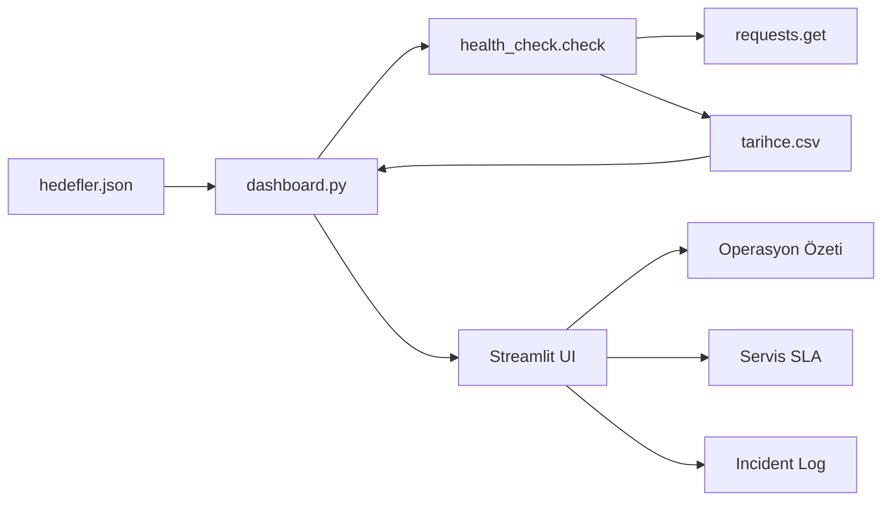

# Sağlık Dashboard'u — Mini NOC Ekranı

**KONSALT Staj Programı 2026 · Challenge 8**  
Seviye: Orta · Stack: Python 3 · Streamlit · requests  
Ön koşullar: [Challenge 3](https://github.com/beyzayilmaz1/konsalt_challenge03_apikasifi) ve [Challenge 6](https://github.com/beyzayilmaz1/konsalt-challenge-06-mini-envanter-api)

Operasyon ekiplerinin sistemlere tek tek bakmak yerine tek ekrandan izlediği NOC (Network Operations Center) yaklaşımının minik bir uygulaması. Birden fazla servisi periyodik kontrol eder; durumu yeşil / sarı / kırmızı / siyah kartlarla gösterir; yanıt süresi tarihçesini çizer; ardışık erişim kayıplarında alarm üretir.

---

## Yönetici özeti

| Madde | Açıklama |
|--------|----------|
| **Problem** | Dağınık servislerin sağlığını tek bakışta görmek |
| **Çözüm** | Streamlit tabanlı canlı health-check dashboard |
| **İzlenen hedefler** | Challenge 6 API, Open-Meteo, RestCountries, kasıtlı bozuk hedef |
| **Durum modeli** | `SAGLIKLI` / `YAVAS` / `HATALI` / `ULASILAMIYOR` |
| **Kalıcılık** | Her kontrol `tarihce.csv` dosyasına append edilir |
| **Alarm** | Üst üste 3 `ULASILAMIYOR` → kart üstünde ⚠ ALARM |
| **Bonus** | `hedefler.json`, uptime %, Challenge 6'da kasıtlı yavaşlık |
| **Ek özellik** | Operasyon özeti + Incident Log + Servis SLA özeti |
| **CI** | GitHub Actions ile otomatik test |

**Teslim paketi**

| Dosya | Rol |
|--------|-----|
| `dashboard.py` | Streamlit uygulaması |
| `health_check.py` | `check()` çekirdeği + uptime / alarm yardımcıları |
| `hedefler.json` | İzlenecek hedefler (kod değişmeden genişletilebilir) |
| `SAGLIK_KURALLARI.md` | Neden 1 sn eşiği? Neden `YAVAS` ayrı? |
| `TESLIM_RAPORU.md` | Yöneticiye yönelik teknik teslim raporu |
| `tests/test_health_check.py` | Mock tabanlı birim testleri |
| `tests/test_metrics.py` | Metrik ve alarm yardımcı testleri |
| `.github/workflows/ci.yml` | Push/PR'de otomatik test |
| `screenshots/` | Dashboard ekran görüntüleri (alarmlı an dahil) |
| `requirements.txt` | Bağımlılıklar |
| `README.md` |Kılavuz |

### Galip Bey ile paylaşılacak resmi teslim listesi

| Zorunlu | Dosya |
|---------|--------|
| Streamlit uygulaması | `dashboard.py` |
| Kılavuz + ekran görüntüleri | `README.md` + `screenshots/` (normal + **alarmlı** an) |
| Sağlık kuralları tanımı | `SAGLIK_KURALLARI.md` — neden 1 sn eşiği, neden `YAVAS` ayrı? |

---

## Hızlı başlangıç

### 1. Bağımlılıklar

```bash
cd konsalt-challenge-08-health-dashboard
pip install -r requirements.txt
```

### 2. Challenge 6 API'yi başlatın (ayrı terminal)

```bash
cd ../konsalt-challenge-06-mini-envanter-api-main
pip install -r requirements.txt
python -m uvicorn main:app --port 8000
```

`GET http://127.0.0.1:8000/health` → `{"status":"ok"}` dönmelidir.

### 3. Dashboard'u çalıştırın

```bash
python -m streamlit run dashboard.py
```

> Windows'ta `streamlit` komutu tanınmıyorsa yukarıdaki `python -m streamlit ...` biçimini kullanın.

Tarayıcı otomatik açılır (varsayılan: http://localhost:8501).

---

## Challenge kapsamı

| Görev | İçerik | Durum |
|--------|--------|--------|
| 1 | `check(url, timeout=3)` — dört durum modeli | Tamamlandı |
| 2 | Streamlit durum kartları + `st.metric` + Yenile butonu | Tamamlandı |
| 3 | `tarihce.csv` + `st.line_chart` yanıt süresi grafikleri | Tamamlandı |
| 4 | 30 sn otomatik yenileme + 3× ULASILAMIYOR alarmı | Tamamlandı |
| Bonus | `hedefler.json` configuration management | Tamamlandı |
| Bonus | Son 100 kontrol uptime yüzdesi | Tamamlandı |
| Bonus | Challenge 6 `HEALTH_DELAY_SECONDS=2` ile YAVAS yakalama | Tamamlandı |
| Ek | Birim testleri, yönetici raporu, sağlık kuralları belgesi | Tamamlandı |
| Ek | Operasyon özeti + Incident Log | Tamamlandı |
| Ek | Servis SLA özeti, alarm detayı, GitHub Actions CI | Tamamlandı |

---

## Health check kuralları (kısa)

| Durum | Koşul | Kart |
|-------|--------|------|
| **SAGLIKLI** | HTTP 2xx ve süre &lt; 1000 ms | 🟢 |
| **YAVAS** | HTTP 2xx ve süre ≥ 1000 ms | 🟡 |
| **HATALI** | HTTP 4xx / 5xx | 🔴 |
| **ULASILAMIYOR** | Bağlantı hatası / timeout (status kodu yok) | ⚫ |

Ayrıntılı gerekçe: [`SAGLIK_KURALLARI.md`](SAGLIK_KURALLARI.md).

---

## Doğrulama senaryoları

### Ek özellik: Operasyon özeti + Incident Log

- Üst bölümde toplam servis sayısı, `SAGLIKLI` / `YAVAS` / `HATALI` / `ULASILAMIYOR` dağılımı ve ortalama yanıt süresi görünür.
- Alt bölümde sağlıksız tüm olaylar kronolojik olarak listelenir.
- Aynı hedef üst üste 3 kez `ULASILAMIYOR` olduğunda Incident Log içinde olay etiketi `ALARM` olur.

### Temel (4 kart, doğru renkler)

1. Challenge 6 API ayaktayken dashboard'u açın.
2. Beklenen: Mini Envanter + Open-Meteo + RestCountries → 🟢 (veya ağ gecikmesinde 🟡); Bozuk Hedef → ⚫ ULASILAMIYOR.
3. "Şimdi Yenile" ile anlık tekrar kontrol edin.

### Alarm (Kontrol noktası 4)

1. Challenge 6 API'yi durdurun (Ctrl+C).
2. Dashboard'un 3 otomatik yenilemesini bekleyin (~90 sn) veya üç kez "Şimdi Yenile"ye basın.
3. Mini Envanter kartında **⚠ ALARM** görünmelidir.
4. API'yi yeniden başlatın → sonraki kontrollerde alarm söner, durum 🟢'e döner.

### Bonus: YAVAS yakalama

Challenge 6 terminalinde:

```bash
# Windows PowerShell
$env:HEALTH_DELAY_SECONDS="2"; python -m uvicorn main:app --port 8000
```

Dashboard Mini Envanter kartında **🟡 YAVAS** görmelidir (yanıt ~2000 ms).

### Bonus: Yeni hedef ekleme

`hedefler.json` dosyasına yeni bir obje ekleyin, dashboard'u yenileyin — kod değişikliği gerekmez.

### Birim testleri

```bash
python -m unittest discover -s tests -v
```

---

## Mimari



### Veri akışı

```text
hedefler.json ──► dashboard.py ──► health_check.check()
                      │                    │
                      ▼                    ▼
               tarihce.csv ◄──── requests.get(url)
                      │
                      ▼
         uptime / alarm / incident / grafikler
```

- Streamlit her etkileşimde scripti **baştan** çalıştırır; bu yüzden tarihçe bellekte değil dosyada tutulur.
- Otomatik yenileme: `time.sleep(30)` + `st.rerun()` (sidebar'dan kapatılabilir).
- Alarm hesabı: ilgili hedefin `tarihce.csv` içindeki son 3 kaydına bakılır.

---

## Engineering Decisions

### Neden `hedefler.json`?

- Challenge bonus kapsamına uygun **configuration management** sağlar.
- Yeni servis eklemek için kod değiştirmeye gerek kalmaz.
- SQLite veya harici DB bağımlılığı eklemeden taşınabilir kalır.

### Neden `tarihce.csv`?

- Streamlit her rerun'da state'i sıfırlar; kalıcılık dosyada tutulmalıdır.
- Append-only CSV, challenge kapsamı için yeterli ve anlaşılırdır.
- Grafik, uptime ve incident log aynı kaynaktan türetilir.

### Neden 1 saniye eşiği ve `YAVAS` ayrı durum?

- "Çalışıyor" ile "sağlıklı" aynı şey değildir.
- Operasyon ekipleri latency bozulmasını kesintiden ayrı görmek ister.
- Ayrıntılı gerekçe: [`SAGLIK_KURALLARI.md`](SAGLIK_KURALLARI.md).

### Neden alarm eşiği 3?

- Tek seferlik timeout'ların alarm üretmesi engellenir (basit anti-flapping).
- Gerçek NOC sistemlerinde de benzer eşik mantığı kullanılır.

### Neden büyük modüler refactor yapılmadı?

- `health_check.py` domain mantığını, `dashboard.py` sunumu taşır.
- Challenge kapsamında bu ayrım yeterlidir.
- Teslim öncesi gereksiz dosya parçalama riski alınmadı.

---

## Known Limitations

- Her Streamlit rerun'ında yeni probe çalışır ve `tarihce.csv`'ye kayıt eklenir.
- `tarihce.csv` sınırsız büyür; retention/rotation yoktur.
- Retry mekanizması yoktur; tek probe sonucu kullanılır.
- Çoklu kullanıcı senaryosunda CSV eşzamanlı yazım riski teoriktir.
- Harici API'ler (Open-Meteo, RestCountries) ağ koşullarına bağlıdır.
- Alarm süresi, kayıt zaman damgalarından türetilir; probe aralığı değişirse yorum dikkatle yapılmalıdır.

---

## Future Improvements

- SQLite veya PostgreSQL ile zaman serisi saklama
- Prometheus / Grafana entegrasyonu
- E-posta veya Slack alarm bildirimi
- Docker ile tek komutla çalıştırma
- Servis detay sayfası (son N kontrol geçmişi)
- Retry + exponential backoff
- Kimlik doğrulama (dashboard erişimi)

---

## CI

Push veya pull request sonrası GitHub Actions otomatik olarak birim testlerini çalıştırır:

```bash
python -m unittest discover -s tests -v
```

Workflow dosyası: [`.github/workflows/ci.yml`](.github/workflows/ci.yml)

---

## Ekran görüntüleri

| Dosya | Açıklama |
|--------|----------|
| `screenshots/01-normal.png` | Dört kartın sağlıklı / ulasilamiyor görünümü |
| `screenshots/02-alarm.png` | Challenge 6 kapalıyken alarmlı an |

---

## Hızlı doğrulama (5 dk)

Challenge 6 API ve dashboard çalışırken:

```bash
python -c "import json; from health_check import check; [print(h['ad'], check(h['url'])['durum']) for h in json.load(open('hedefler.json',encoding='utf-8'))]"
```

Beklenen: ilk üç hedef `SAGLIKLI`, `Bozuk Hedef` → `ULASILAMIYOR`.

Alarm testi: Challenge 6 API'yi durdurun → dashboard'da 3 kez "Şimdi Yenile" → Mini Envanter kartında ⚠ ALARM.

---

## İlgili belgeler

- [`SAGLIK_KURALLARI.md`](SAGLIK_KURALLARI.md) — eşik tasarımı
- [`TESLIM_RAPORU.md`](TESLIM_RAPORU.md) — yönetici teslim raporu
